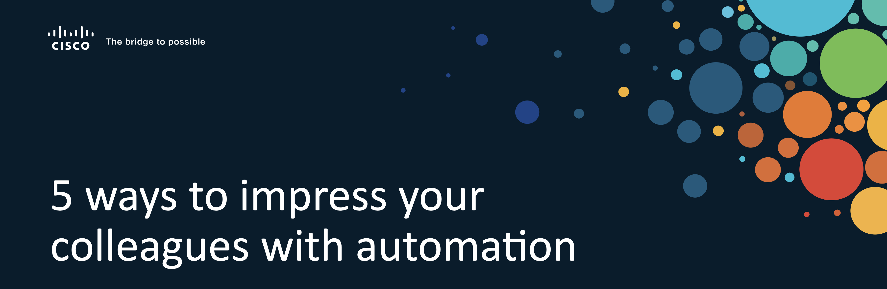

# Cisco Live 2022 - DEVNET-1970 Companion Guide

Welcome to the companion guide for our DEVNET-1970 session at Cisco Live 2022. In this document we want to give you a bit more context around each of the demos shown during the delivery of the session as well as explain the source code or tools used for each of the demos in-depth. 

## Overview

* **Demo 1: Information Gathering** is concerned with retrieving information from all of your switches. In the example we are retrieving the version of the operating system currently running on the switch - but this could of course be expanded to any information you want to report on in bulk. [To Demo](sections/01-info_gathering/)
* **Demo 2: Configuration diffs** uses the built-in `learn` function of pyATS to allow us to retrieve a snapshot of a router configuration and be able to calculate the difference at a later stage, for example after changing the configuration or in case of an outage. [To Demo](sections/02-config_diff/)
* **Demo 3: Verify BGP Neighbor status using pyATS** shows you how to use a pyATS testcase to verify that all BGP neighbors are established. This example shows how you can codify common tests you would normally do manually when troubleshooting or verifying functionality in a network. [To Demo](sections/03-pyats_bgp/)
* **Demo 4: Parallelized configuration pushing using pyATS and RQ** leverages two open source tools, pyATS and RQ, to build a simple parallel configuration delivery functionality that would be capable of, in parallel, push a configuration change to multiple devices. [To Demo](sections/04-parallel_config/)

## A word on the NetDevOps pipeline demo

The fifth demo that showcased a NetDevOps pipeline is based on a previous session delivered in a Partner Interactive Webinar. You can find the lab guide for this demo [here](https://github.com/sQu4rks/netdevops-pipeline-lab/). Please be aware that this is a more involved demo that will require some setup from your side. You can find the demo video [here](https://youtu.be/-1-LyXTOUd8).

## A word on setup

For these demos to work you will need a functional pyATS installation. You may find instructions on how to install pyATS on different platforms [here](https://pubhub.devnetcloud.com/media/pyats/docs/getting_started/index.html#installation). 

For demos 1, 2 and 4 we provide a sample testbed that uses an Always-On Cisco DevNet sandbox device so there is no device setup required from you. 

To run demo 4 on your own setup you'll need a (virtual) lab with a topology that runs BGP. If you have access to a CML instance (or reserve a CML sandbox [here](https://devnetsandbox.cisco.com)) you can follow the instructions in [this guide](https://jasonmurray.org/posts/2021/basicbgp/) to setup a basic BGP lab. This is the same lab we used in the demo.

## Acknowledgements

* The config diff example is based on [this repository](https://github.com/hpreston/genie-config-diff) by [Hank Preston](https://twitter.com/hfpreston)
* The BGP lab used in the demo is based on [this guide](https://jasonmurray.org/posts/2021/basicbgp/) by [Jason Murray](https://twitter.com/0xJasonMurray/)
* The BGP test itself is based on [this work](https://github.com/kecorbin/pyats-network-checks) by [Kevin Corbin](https://twitter.com/kecorbin)

   
   Previous - [Next](sections/01-info_gathering/)

