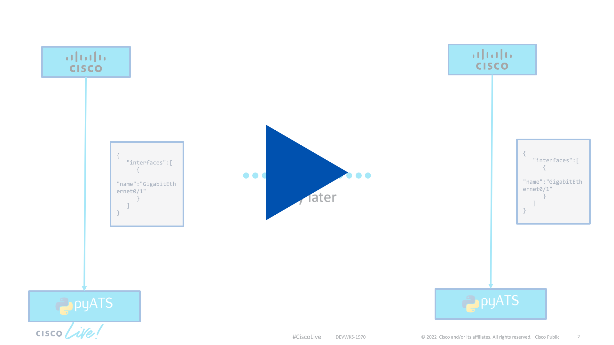

# Configuration Diffs

[](https://youtu.be/2xc0VALO0uk)

<div align="center" ><i>Click the image to view the demo video</i></div>

Since pyATS allows us to retrieve **structured** data from a device this makes it very easy to retrieve the *state* of a device and then, maybe after some changes or during an outage you are trying to troubleshoot, you can retrieve the *state* of your device again and compare the two to see what has changed. 

1. For this demo, we'll once again use a device in the Cisco Sandbox. Create a new folder called `02-config_diff`. In it, create a file called `testbed.yaml`, with the following content. 
```yaml
---
testbed:
  name: alwaysonsbxs
  credentials: 
    default:
      username: "developer"
      password: "C1sco12345"
      enable: "C1sco12345"

devices:
  csr1000v-1:
    os: iosxe
    type: iosxe
    connections:
      defaults:
        class: unicon.Unicon
      ssh:
        protocol: ssh
        ip: "sandbox-iosxe-latest-1.cisco.com"
        port: "22"
```
2. Your directory structure should now look like this:
```
- 02-config_diff
  |- testbed.yaml
```
3. Make sure that you are inside of the `02-config_diff` folder. We'll now instruct pyats to learn the `config` feature of all the devices in the testbed we specify using the `--testbed-file` option. The output is then saved into a folder called `old`.
```
$ genie learn config --testbed-file testbed.yaml --output old
```

Let's pause here for a second and explain what a *feature* is. In pyATS, a devices functionality is modled into a set of *features*. An example for a *feature* is our config which captures the entire devices current running configuration but if you have a routing protocol like OSPF or BGP configured on your device, these are *features* that could be learned as well(`genie learn bgp --testbed-file testbed.yaml --output bgp_only` - This won't work on the sandbox since BGP is not configured there). 

When we instruct pyATS to *learn* a feature,your devices BGP configuration for example, pyATS will issue a set of commands to the device and retrieve all information of your BGP configuration. These information are then summarized into a computer-readble structured data file. 

Let's have a look at each of the files that has been created. After running the command in step 3, your folder should have the following structure:

```
- 02-config_diff
  |- testbed.yaml
  |- old/
     |- config_iosxe_csr1000v-1_console.txt
     |- config_iosxe_csr1000v-1_ops.txt
     |- connection_csr1000v-1.txt
```
The `connection_csr1000v-1.txt` file contains the connection log from pyATS. `config_iosxe_csr1000v-1_console.txt` contains the raw text of the commands that have been issued. Here you can see all the commands (in case of this example only the `show running-config` command) and their output that were parsed for this feature. Finally, `config_iosxe_csr1000v-1_ops.txt` is a json-dump of the dictionary containing all the information parsed from the `show running-config` command. 

4. Now in order to see a difference between the two snapshots we'll have to make some changes to the device. The changes you do are up to you. For this example we will change the interface status as well as the description of our `GigabitEthernet 2` interface. SSH into the device, go into enable and then config mode and change the interface configuration before exiting. The username is `developer` and the password is `C1sco12345`.

```
$ ssh developer@sandbox-iosxe-latest-1.cisco.com
csr1000v-1# enable
csr1000v-1# conf t
csr1000v-1(config)# interface GigabitEthernet 2
csr1000v-1(config-if)# description New networking interface
csr1000v-1(config-if)# shutdown
csr1000v-1(config-if)# exit
csr1000v-1(config)# exit
```
5. With our changes done, disconnect from the device and come back to the terminal on your computer. We can now take another snapshot of the device configuration. The command is the same as in step 3 with the only difference beeing the output directory. 
```
$ genie learn config --testbed-file testbed.yaml --output new
```
6. We now have a new folder called `new` with the same structure as the `old` folder. We can instruct genie to calculate the diff between the two configuration snapshots. 
```
$ genie diff old new
```
7. The previous step will create a new file containing the diff for each device. In our example this diff file will be called `diff_config_iosxe_csr1000v-1_ops.txt`. You can show the content of the diff using the `cat` command.
```
$ cat diff_config_iosxe_csr1000v-1_ops.txt
```

<div align="right">
   
   [Previous](../01-info_gathering/) - [Next](../03-pyats_bgp/)
</div>