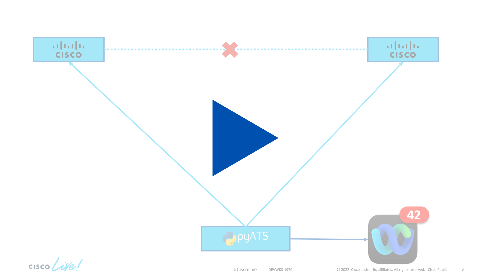

# Verify BGP Neighbor status using pyATS

[](https://youtu.be/XUhweCS5F44)

<div align="center" ><i>Click the image to view the demo video</i></div>

A powerful concept in software engineering is _automated testing_. The idea here is to be able to programmatically verify that a software is working as intended. This is achieved by writing test cases where the outcome is known to the developer writing the test beforehand. This is the same concept we are going to be using in pyATS.

Even though we have so far only looked at the other aspects of the framework, pyATS was initally developed to allow engineering teams inside Cisco to easily write tests for network devices, hence the name **py**thon **A**utomated **T**est **S**ystem, or **pyATS**. 

By leveraging the parsing and learning functionality we have already seen in previous examples, we can codify our verification and troubleshooting workflows. Think about the checks you do manually either after a config change or when you are troubleshooting a problem - these are perfect candidates for checks that should/could be codified. 

In this example we are looking at a test case that verifies BGP neighbors are correctly established. We do this by connecting to all our devices in the testbed file, learn the BGP feature for each of these devices, and then verify  all peers are established. 

1. Create a new folder called `03-pyats_bgp`. We will need three different files in it. A `testbed.yaml` file, a `BGP_Neighbors_Established.py` file in which we will define our test case and a file called `bgp_check_job.py` that will be used to run our test case. Since this demo requires BGP to be properly configured we can't provide you with a `testbed.yaml` file since BGP is not configured on the always-on sandbox devices. You can get a CML environment from the [DevNet Sandboxes](https://devnetsandbox.cisco.com). You can then either setup a BGP lab yourself or follow [this guide](https://jasonmurray.org/posts/2021/basicbgp/) by [Jason Murray](https://twitter.com/0xJasonMurray/). The lab used in the demo shown at Cisco Live was based on the architecture in that guide. Once you have setup your folder structure it should look like this:
```
- 03-pyats_bgp
  |- testbed.yaml
  |- BGP_Neighbors_Established.py
  |- bgp_check_job.py
``` 
2. We will start by writing our test case so open up the `BGP_Neighbors_Established.py` file. Let's first import a few necessary modules at the top of our file. You might have to install the `tabulate` package by running `pip3 install tabulate`.
```python
import logging
import json

from tabulate import tabulate

from ats import aetest
from ats.log.utils import banner

from genie.conf import Genie
from genie.abstract import Lookup

from genie.libs import ops # noqa
```

Before diving fully into writing the test let's have a look at how a pyATS test case looks like in general. 

pyATS uses a generalized testing framework called `AEtest` (short for **A**utomated **E**asy **test**ing) to describe automated tests. A test will usually contain at least three components:

* One *CommonSetup* that will be run once before all the test cases. As the name suggests this part is for carrying out setup tasks such as connecting to your devices, load a base configuration or verify a device state prior to testing. 
* One or more *TestCase(s)*. These are your actual tests that verify functionality. TestCases either `PASS` or `FAIL`.
* One *CommonCleanup* that runs once at the end of a script and that can be used clean up after the tests. Common things to do here include disconnecting from the devices or deleting any residual configuration that was done during the testing itself. 

3. Coming back to our test case, let's implement the *CommonSetup* functionality. AETest designates a class to be a *CommonSetup*, a *TestCase* or a *CommonCleanup* by inheriting from the respective parent class. While you can call these classes however you like it is common practice to name the *CommonSetup* class `common_setup` and it inherits from `aetest.CommonSetup`. 
```python
class common_setup(aetest.CommonSetup):
```
4. Inside the `common_setup` class we now create a function called `connect()`. Using the `aetest.subsection` decorator we denote this function to be a subsection of our *CommonSetup* task. Inside of this function we will now connect to all our devices in the testbed and store a list of all device objects for later usage during our tests. We only connect to devices that start with `csr1000v` in this example because all our routers in the lab do start with that name. Notice how we store the list of devices (`device_list` variable) as a parameter in the parent for usage later on in our test cases.
```python
    @aetest.subsection
    def connect(self, testbed):
        genie_testbed = Genie.init(testbed)
        self.parent.parameters['testbed'] = genie_testbed
        device_list = []
        for device in genie_testbed.devices.values():
            if not device.name.startswith("csr1000v"):
                continue
            log.info(banner(f"Connect to device '{device.name}'"))
            try:
                device.connect(log_stdout=False)
            except Exception as e:
                self.failed(f"Failed to establish connection to '{device.name}'")

            device_list.append(device)

        # Pass list of devices the to testcases
        self.parent.parameters.update(dev=device_list)
```
5. With our `common_setup` completed, we can get to work writing our test case. The class representing our test case needs to inherit from `aetest.Testcase`. 
```python
class BGP_Neighbors_Established(aetest.Testcase):
```
6. Within our `Testcase` class, we can designate a function as a test by using the `aetest.test` decorator. All functions that have been decorated as such will be run in sequential order. This allows us to split the functionality into multiple functions and make the code easier to handle. In our demo we will have two such functions, `learn_bgp` which will learn the `bgp` feature from all our devices and `check_bgp` that will verify that the neighbors are established and present the results in a nicely formatted fashion. Let's start with the learning of our bgp feature. We iterate over all of our previously connected device objects, learn the bgp feature for each of them and then store the information from usage in the `check_bgp` section.
```python
   @aetest.test
   def learn_bgp(self):
      self.all_bgp_sessions = {}
      for dev in self.parent.parameters['dev']:
            log.info(banner("Gathering BGP Information from {}".format(
                dev.name)))
            abstract = Lookup.from_device(dev)
            bgp = abstract.ops.bgp.bgp.Bgp(dev)
            bgp.learn()
            self.all_bgp_sessions[dev.name] = bgp.info
```
7. With our bgp feature information extracted and stored we can then check that neighbors are established in our `check_bgp` test. Here we iterate over all the previously saved bgp sessions, extract the neighbors and check the state for each of those neighbors. In order to make the results easier to digest by a human we compile all this information into a table. If any of the neighbors is *not* in `established` state, we fail the test case and print the information on the offending configuration as well as the connection table compiled before.
```python
    @ aetest.test
    def check_bgp(self):
        failed_dict = {}
        mega_tabular = []
        for device, bgp in self.all_bgp_sessions.items():
            # may need to change based on BGP config
            default = bgp['instance']['default']['vrf']['default']
            neighbors = default['neighbor']
            for nbr, props in neighbors.items():
                state = props.get('session_state')
                if state:
                    tr = []
                    tr.append(device)
                    tr.append(nbr)
                    tr.append(state)
                    if state == 'established' or state == 'Established':
                        tr.append('Passed')
                    else:
                        failed_dict[device] = {}
                        failed_dict[device][nbr] = props
                        tr.append('Failed')

                mega_tabular.append(tr)

        log.info(tabulate(mega_tabular,
                          headers=['Device', 'Peer',
                                   'State', 'Pass/Fail'],
                          tablefmt='orgtbl'))

        if failed_dict:
            log.error(json.dumps(failed_dict, indent=3))
            self.failed("Testbed has BGP Neighbors that are not established")

        else:
            self.passed("All BGP Neighbors are established")
```
8. And finally, we need our cleanup. A cleanup needs to inherit from `aetest.CommonCleanup` and is usually called `common_cleanup`. In this demo we are just disconnecting from all devices. 
```python
class common_cleanup(aetest.CommonCleanup):
    @aetest.subsection
    def clean_everything(self):
        for dev in self.parent.parameters['dev']:
            dev.disconnect()
```
9. Finally, we include some information on how to run this test by providing a main function.
```python
if __name__ == '__main__':  # pragma: no cover
    aetest.main()
```
10. With our test case written we just need to write a smaller wrapper so that we can run the test case using the pyats command-line tool. While you could just run the test case file itself (this is what we have enabled in step 9), by writing a small wrapper and running the test via the cli tool we get some nice features such as a web based liveview or log storage for consecutive runs. For our wrapper, open up the `bgp_check_job.py` file. In it, we calculate the path to the python file containing our test, in our case the `BGP_Neighbors_Established.py` file, and then provide a main function that calls the `run()` function passing on the path to the testscript.
```python
import os
from ats.easypy import run

def main():
    pwd = os.path.dirname(__file__)
    bgp_tests = os.path.join(pwd, 'BGP_Neighbors_Established.py')
    run(testscript=bgp_tests)
```
11. With this done, we can run our pyATS test case using the command-line. This will open up a new browser window (as shown in the demo) with a live view of the output from your test cases. If you BGP is configured properly you should see the `learn_bpg` and `check_bgp` cases both succeed. 
```
$ pyats run job bgp_check_job.py --testbed-file testbed.yaml --liveview
```

The entire `BGP_Neighbors_Established.py` file looks like this:
```python
#!/bin/env python
import logging
import json

from tabulate import tabulate

from ats import aetest
from ats.log.utils import banner

from genie.conf import Genie
from genie.abstract import Lookup

from genie.libs import ops # noqa

# Get your logger for your script
log = logging.getLogger(__name__)

class common_setup(aetest.CommonSetup):
    """ Common Setup section """
    @aetest.subsection
    def connect(self, testbed):
        genie_testbed = Genie.init(testbed)
        self.parent.parameters['testbed'] = genie_testbed
        device_list = []
        for device in genie_testbed.devices.values():
            if not device.name.startswith("csr1000v"):
                continue
            log.info(banner(
                "Connect to device '{d}'".format(d=device.name)))
            try:
                device.connect(log_stdout=False)
            except Exception as e:
                self.failed("Failed to establish connection to '{}'".format(
                    device.name))

            device_list.append(device)

        # Pass list of devices the to testcases
        self.parent.parameters.update(dev=device_list)

class BGP_Neighbors_Established(aetest.Testcase):
    @ aetest.test
    def learn_bgp(self):
        self.all_bgp_sessions = {}
        for dev in self.parent.parameters['dev']:
            log.info(banner("Gathering BGP Information from {}".format(
                dev.name)))
            abstract = Lookup.from_device(dev)
            bgp = abstract.ops.bgp.bgp.Bgp(dev)
            bgp.learn()
            self.all_bgp_sessions[dev.name] = bgp.info

    @ aetest.test
    def check_bgp(self):
        failed_dict = {}
        mega_tabular = []
        for device, bgp in self.all_bgp_sessions.items():
            # may need to change based on BGP config
            default = bgp['instance']['default']['vrf']['default']
            neighbors = default['neighbor']
            for nbr, props in neighbors.items():
                state = props.get('session_state')
                if state:
                    tr = []
                    tr.append(device)
                    tr.append(nbr)
                    tr.append(state)
                    if state == 'established' or state == 'Established':
                        tr.append('Passed')
                    else:
                        failed_dict[device] = {}
                        failed_dict[device][nbr] = props
                        tr.append('Failed')

                mega_tabular.append(tr)

        log.info(tabulate(mega_tabular,
                          headers=['Device', 'Peer',
                                   'State', 'Pass/Fail'],
                          tablefmt='orgtbl'))

        if failed_dict:
            log.error(json.dumps(failed_dict, indent=3))
            self.failed("Testbed has BGP Neighbors that are not established")

        else:
            self.passed("All BGP Neighbors are established")

class common_cleanup(aetest.CommonCleanup):
    @aetest.subsection
    def clean_everything(self):
        for dev in self.parent.parameters['dev']:
            dev.disconnect()

if __name__ == '__main__':  # pragma: no cover
    aetest.main()

```

The entire `bgp_check_job.py` file looks like this:

```python
import os
from ats.easypy import run

def main():
    pwd = os.path.dirname(__file__)
    bgp_tests = os.path.join(pwd, 'BGP_Neighbors_Established.py')
    run(testscript=bgp_tests)
```

<div align="right">
   
   [Previous](../02-config_diff/) - [Next](../04-parallel_config/)
</div>