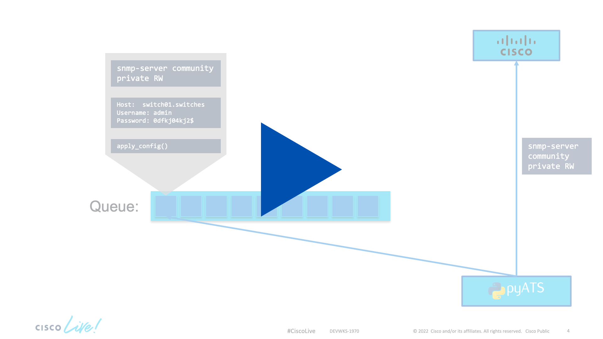

# Parallelized configuration pushing using pyATS and RQ

[](https://youtu.be/HPBP2iWe1GQ)

<div align="center" ><i>Click the image to view the demo video</i></div>

When pushing configuration changes to network devices _a difference in scale can become a difference in kind_. While a simple script that sequentially applies the config to a list of devices can be sufficient to push your desired change in a small topology, once you are dealing with hundred or thousands of devices speed becomes important. The easiest way to improve speed is to parallelize your code.

By using a simple worker queue system we create a *job* for each of our devices. The *job* contains the information of which device we want to apply what configurtion to and what python code we want to use to do so. A job is put into the *queue* and there a *worker* can pick up the job, execute it, and move on to the next one. By having multiple *workers* we can massively speed up the deployment of changes without adding too much overhead. 

In this demo we'll be using *Redis Queues*, or short *RQ*, to build our queue system. As the name suggests, this is a queue system build on redis. 

While this might sound like a big task we will do the entire thing in around 30 lines of code. 

1. For setup we will need a few things, including getting redis installed. You can either [install redis locally](#todo) or [run it using docker](#todo). Once you have installed redis, start a redis server.
2. Create a new folder called `04-parallel_config`. In it we will need a `testbed.yaml` file again, as well as two python files: `tasks.py` will contain our function definitions and `add_job.py` will be used to create the jobs. Your folder structure should now look like this:
```
- 04_parallel_config
  |- testbed.yaml
  |- tasks.py
  |- add_job.py
```
3. Add the following informtion to yoour `testbed.yaml` file
```yaml
---
testbed:
  name: alwaysonsbxs
  credentials: 
    default:
      username: "developer"
      password: "C1sco12345"
      enable: "C1sco12345"

devices:
  csr1000v-1:
    os: iosxe
    type: iosxe
    connections:
      defaults:
        class: unicon.Unicon
      ssh:
        protocol: ssh
        ip: "sandbox-iosxe-latest-1.cisco.com"
        port: "22"
```
3. Next, open up the `tasks.py` file. Here we are going to define the jobs that can be queued and then executed by the workers. A *job* in RQ is simply a function. We will need to import the testbed loading function from pyATS before we can get started defining our function/job.
```python
from genie.testbed import load
```
4. Inside the `tasks.py` file, next define a function called `apply_config()` that will take the testbed file name, the name of the device we want to run the commands against and a list of config commands as arguments. 
```python
def apply_config(testbed, device, config):
```
5. Inside the function we are first going to load the testbed and connect to the device the same way we did already in the first demo. We chose the device based on the name that is being passed in the `device` parameter.
```python
   tb = load(testbed)

   dev = tb.devices[device]
   print(f"Connecting to device {dev.name}")
   dev.connect(log_stdout=False)
```
6. Next, we need to apply the configuration. To do that, each *device* object in pyATS has a `configure()` command that will take care of going into configuration mode and then apply the commands we pass inside the `config` parameter.
```python
   print("Applying config")
   print("\n".join(config))
   dev.configure(config)
```
7. That's it for our `tasks.py` file and all the code needed to apply a list of configuration commands to a device. Next, open the `add_job.py`. In here we are going to create our `Queue` object, enqueue a job and create the list of commands we want to send to each device in the testbed file. 
```python
from rq import Queue
from genie.testbed import load

from tasks import apply_config

config = [
   "snmp-server community private RW"
]
```
8. Load the testbed from the `testbed.yaml` file.
```python
tb = load('testbed.yaml')
```
9. Create a `Queue` object that connects to your local redis instance. This code assumes that Redis is running on the default port (6379) on localhost.
```python
q = Queue(connection=Redis())
```
10. Now we can loop over all the devices in our testbed, check the device type is `router`, and then create a new job on the queue. 
```python
for name, dev in tb.devices.items():
   if dev.type == "router":
      q.enqueue(apply_config, testbed='testbed.yaml', device=name, config=config)
```
11. With our coding done, open another terminal window in the `04-parallel_config` folder. We will now start a rq worker that will be able to pick up any jobs coming into the queue. Please note that by not specifying a queue name in the previous job, all jobs will be put on the `default` queue. The command below will start a new worker.
```
$ rq worker default
```
12. In the other terminal, run the `add_job.py` file to queue the jobs.
```
$ python3 add_job.py
```

The entire `tasks.py` file looks like this:
```python
from genie.testbed import load

def apply_config(testbed, device, config):
    tb = load(testbed)

    dev = tb.devices[device]
    print(f"Connecting to device {dev.name}")
    dev.connect(log_stdout=False)

    print("Applying config:")
    print("\n".join(config))
    dev.configure(config)


```

The entire `add_job.py` file looks like this:

```python
from redis import Redis
from rq import Queue

from genie.testbed import load

from tasks import apply_config

config = [
    "snmp-server community private RW"
]

tb = load('testbed.yaml')

q = Queue(connection=Redis())
for name, dev in tb.devices.items():
    if dev.type == "router":
        q.enqueue(apply_config, testbed="testbed.yaml", device=name, config=config)
```

<div align="right">
   
   [Previous](../03-pyats_bgp/) - Next
</div>